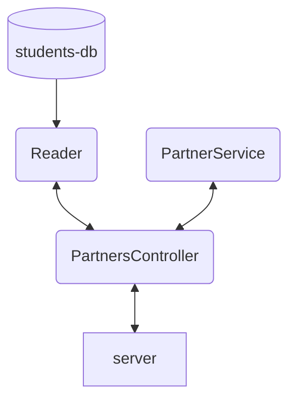
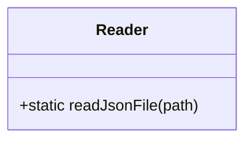
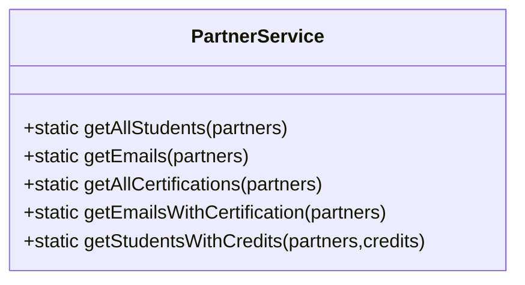
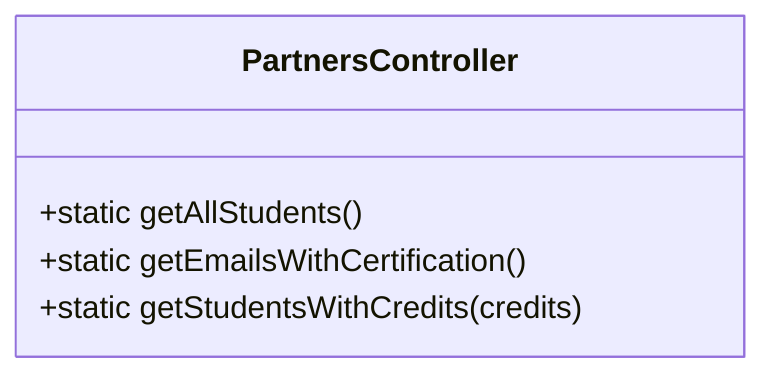

# Code Challenge week 4.
## Project vp-students-api

This project was made by [@JonathanJRodriguez](https://github.com/JonathanJRodriguez) for Innovacción Virtual - Backend JS - Code challenge week 4.

It was developed following the TDD methodology (Test driven development).

## Documentation.
**Estimated time to develop:** 16 hours (including Documentation)

**Time taken to develop:** 5 hours

### Dependencies used:
* Jest: Unit testing
* ESLint: Style
* Express: Create Server

### Features:
1. Get all students from the DB
2. Get all emails from the students with certification `haveCertification = true`
3. Get all students with credits > 500 **(Feature enhanced to be credits > userInput)**

The project is divided in 4 main files and the database file, these files are connected as follows:

### Classes
**Reader.**

This class receives a path and returns a list with all elements of a JSON file.

**PartnerService.**

This class does all the operations required by the features.

**PartnersController.**

This class exposes the requested methods to the API, acting as an isolation/concentration layer between logic and server.

**Server**

The server is a basic API made with Express that contains four endpoints and listens port 3000.

### API details.

|Address (Example)|HTML Method|Description|
|--------|:---:|---------|
|`http://localhost:3000/`|GET|Home|
|`http://localhost:3000/v1/students`|GET|Get all the students with all attributes|
|`http://localhost:3000/v1/students/emails`|GET|Get the emails of all the students that have certification|
|``http://localhost:3000/v1/students/credits/:score http://localhost:3000/v1/students/credits/500``|GET|Get all the students with credits greater than `:score`|

 ### Testing.

 For the Unit Testing it uses Jest version 26, the repository has a Github Action that runs the test in every push or online commit.

 ### Project Planning.

 This project was developed using the Github issues as To Do tasks in a Github project (publicly available in this repository), to demonstrate the functionality of these tools.